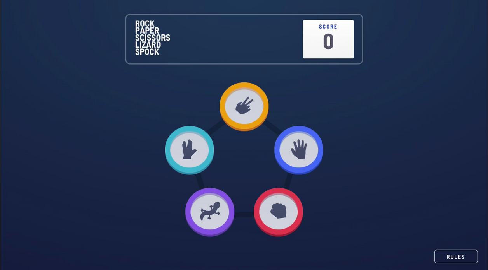
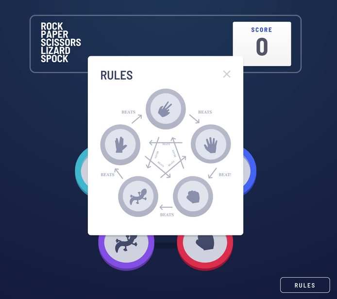
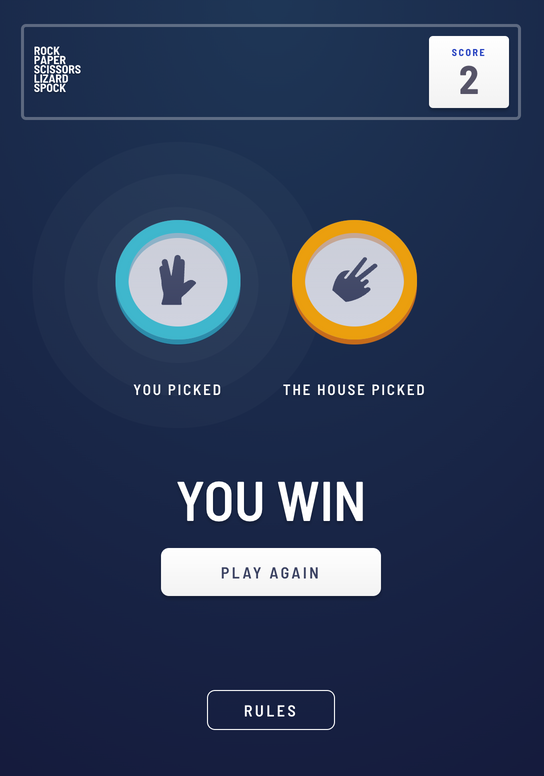

# Rock Paper Scissors Lizard Spock Game

A modern implementation of the extended Rock Paper Scissors game, built with React and TypeScript.

## Project Overview

This web application features:

- React with TypeScript
- Zustand for state management
- Smooth transitions and animations enhancing user interaction
- Responsive design optimized for mobile, tablet, and desktop
- Modern component architecture with modular CSS

---

## Responsive Previews

| Desktop                        | Tablet                        | Mobile                        |
| ------------------------------ | ----------------------------- | ----------------------------- |
|  |  |  |

---

## Game Rules

This game expands on the traditional Rock Paper Scissors with two additional moves:

- Rock crushes Scissors and crushes Lizard
- Paper covers Rock and disproves Spock
- Scissors cuts Paper and decapitates Lizard
- Lizard poisons Spock and eats Paper
- Spock smashes Scissors and vaporizes Rock

## Setup Instructions

1. Clone the repository
2. Install dependencies:
   ```
   npm install
   ```
3. Run the development server:
   ```
   npm run dev
   ```
4. Build for production:
   ```
   npm run build
   ```

## Project Structure

```
├── public/
│   └── assets/
│       └── images/       # Game icons and images
├── src/
│   ├── components/
│   │   ├── Board.tsx           # Game board with options
│   │   ├── BoardSelected.tsx   # Game result display
│   │   ├── GameHeader.tsx      # Score header
│   │   └── Rules.tsx           # Rules modal
│   ├── pages/
│   │   └── Home.tsx            # Main game page
│   ├── store/
│   │   └── useGameStore.tsx    # Zustand store
│   ├── styles/
│   │   └── 2-components/       # Component-specific styles
│   │       └── _rules.css      # Rules component styling
│   ├── App.tsx                 # Main app component
│   ├── main.css                # Global styles
│   └── main.tsx                # Entry point
├── index.html
├── package.json
├── tsconfig.json
└── vite.config.ts
```

## CSS Architecture

The project uses a structured CSS approach with:

- Component-specific stylesheets in dedicated folders
- Fixed positioning for consistent UI elements
- Media queries for responsive design
- Clean class naming conventions

## How To Play

1. Choose one of the five options: Rock, Paper, Scissors, Lizard, or Spock
2. The computer will randomly select its choice
3. Winner is determined based on the game rules
4. Score is updated: +1 for winning, -1 for losing
5. Click "Play Again" to start a new round
