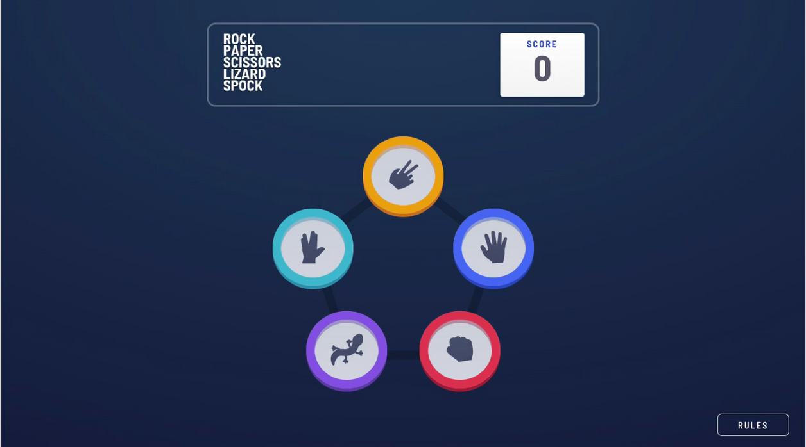
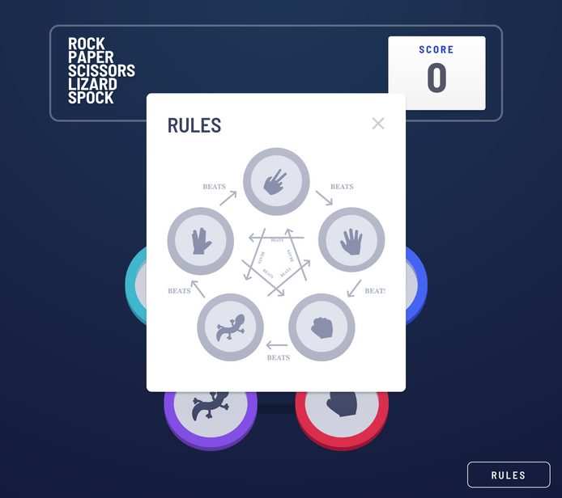
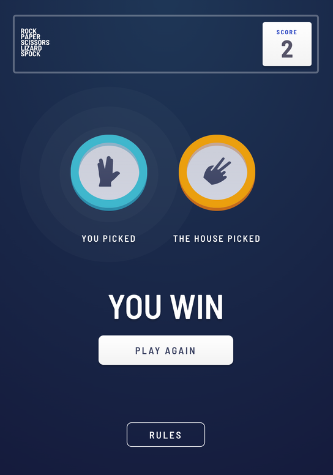

# ✊ Rock, Paper, Scissors, Lizard, Spock

A modern twist on the classic Rock, Paper, Scissors game — now with Lizard and Spock! This responsive app lets users play against the computer, track scores, and enjoy an animated UI that works across all devices.

🔗 **Live Demo**: [https://rock-paper-scissors-ten-flax.vercel.app/](https://rock-paper-scissors-ten-flax.vercel.app/)

---

## 🧱 Tech Stack

- Vue.js  
- JavaScript  
- HTML5 & CSS3  
- Flexbox for layout

---

## 📱 Responsive Previews

| Desktop                     | Tablet                     | Mobile                     |
|----------------------------|----------------------------|---------------------------|
|     |      |      |

---

## ✨ Features

- Play Rock, Paper, Scissors, Lizard, or Spock against the computer
- Score persists after page reload using local storage
- Fully responsive UI with custom graphics
- Smooth animations and intuitive gameplay

---

## 🛠️ Project Setup

```bash
yarn install
```

### Compiles and hot-reloads for development

```bash
yarn serve
```

### Compiles and minifies for production

```bash
yarn build
```

### Lints and fixes files

```bash
yarn lint
```

### Customize configuration

See [Configuration Reference](https://cli.vuejs.org/config/).
